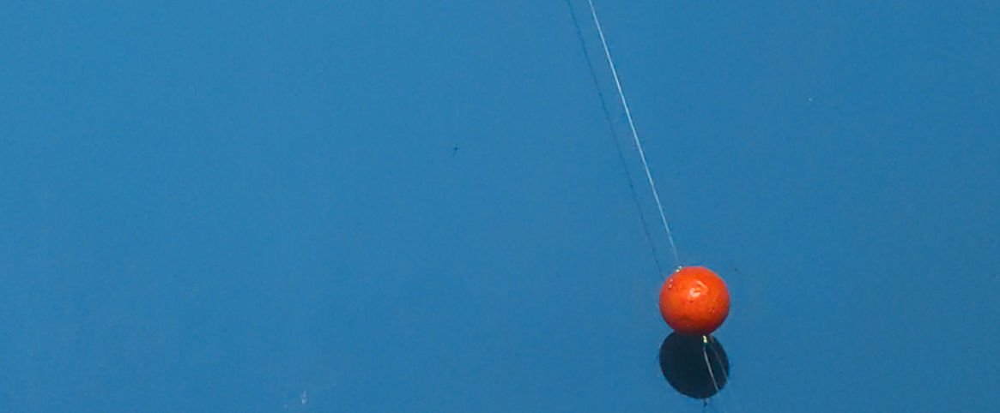

# Pendulum tracker

**Digital image processing**
University of Antioquia
2023·01 

Santiago Bedoya Otálvaro
santiago.bedoyao@udea.edu.co

Luis Mateo Hincapié Martínez
lmateo.hincapie@udea.edu.co

---

## Introduction

The aim of this project is to analyse the motion of a pendulum through video capture and image processing using Python and the OpenCV library. The objective is to obtain precise data on the position, velocity, and acceleration of the pendulum in each frame of the video for subsequent analysis.

To achieve this objective, image processing techniques such as masking, contour detection, erosion, and dilation will be applied to identify and locate the moving object in each frame of the video. With this information, the position of the object will be calculated at each instant in time, and kinematic formulas will be used to calculate the velocity and acceleration of the object.

The obtained data will be analysed by generating graphs to verify if they correspond to a simple harmonic motion and will be compared with theoretical calculations to evaluate the validity of the model used and the accuracy of the proposed method.

This project is relevant in areas such as physics, engineering, and robotics, where motion analysis is fundamental for the design and development of systems and devices. Additionally, this project can have applications in education as a practical tool to teach the concept of simple harmonic motion.

Overall, this work provides a comprehensive analysis of the motion of a pendulum and offers insights into the practical applications of image processing and kinematic formulas in motion analysis.

---

## Description of the procedure

The following steps will be carried out to develop the present work, which will be described in more detail later on. Additionally, you can review the files or scripts generated during the development process at the following link: https://github.com/luismateoh/pendulum-analysis

1. Record a video of the pendulum in motion using a camera.
2. Set up a development environment, in this case using Spyder with Python, and install the necessary libraries such as OpenCV, NumPy, and Matplotlib in Python to perform the image processing and generate graphs.
3. Use image processing techniques to detect and locate the pendulum in each frame of the video. This is achieved by using masking, contour detection, erosion, and dilation.
4. Based on the information obtained in the previous step, calculate the position, velocity, and acceleration of the pendulum at each moment in time. Apply kinematic formulas to obtain these values.
5. Analyse the data obtained and generate graphs to verify if they correspond to simple harmonic motion. Compare the obtained data with theoretical calculations to evaluate the validity of the model used and the accuracy of the proposed method.

### Recording of the video

For the video recording, an orange-colored sphere was used, which contrasts with the blue background. Additionally, the rope that holds the sphere is thin and white. The duration of the video is approximately 15 seconds.



Frame of the example video

### Set up a development environment

To set up the working environment, both Python version 3.11 and Anaconda's Spyder must be installed. Then, the libraries described in the `requirements.txt` file in the repository must be installed.

```python
numpy
opencv-python
matplotlib
pandas
seaborn
```

After installing these libraries, you can proceed to the next step.

### Code Analysis

Next, each part of the code written to perform the procedure for processing each video frame and extracting the object's position, velocity, and acceleration values at each moment in time is analysed.

### `movement_tracker.py`

**Library Importation**
Four libraries are imported in the code: `numpy`, `cv2`, `csv`, and `dist` (from the math library). `Numpy` is used to perform calculations with matrices and vectors. `Cv2` is the main library for image and video processing in Python. `Csv` is used for writing CSV files. Finally, `dist` is used to calculate the distance between two points.

```python
import numpy as np
import cv2
import csv
from math import dist
```

**Variables**
Several variables are defined to store information related to the motion. point_1 and point_2 represent the (x,y) coordinates of the pendulum at two consecutive moments in time or frames. Speed_1 and speed_2 represent the velocity of the pendulum at those two different moments in time. Acceleration is the acceleration of the pendulum at the last measured instant in time. Time is the total elapsed time. Data is a list that stores the information of position, time, velocity, and acceleration at each moment in time.

```python
point_1 = (0, 0)
point_2 = (0, 0)
speed_1 = 0
speed_2 = 0
acceleration = 0
time = 0
data = []
```

**Video Reading**
The video is loaded using the OpenCV capture object. If the loading is not successful, an error message is printed.

```python
cap = cv2.VideoCapture('pendulumVideo.mp4')
if not cap.isOpened():
    print("Error opening video stream or file")
```

**Image Processing**
The function `process_image` is defined, which takes an image and performs the following operations:
a) Convert the image from BGR to HSV.
b) Create a mask to isolate the color of the pendulum.
c) Apply erosion and dilation to reduce the noise in the image.

```python
def process_image(img_frame):
		# BGR to HSV
    in_hsv = cv2.cvtColor(img_frame, cv2.COLOR_BGR2HSV)
    # Mask
    lower = np.array([3, 200, 205])
    upper = np.array([9, 240, 235])
    mask = cv2.inRange(in_hsv, lower, upper)
    # Erosion y Dilation
    kernel = np.ones((3, 3), np.uint8)
    dilate = cv2.dilate(mask, kernel, iterations=20)
    erode = cv2.erode(dilate, kernel, iterations=15)

    return erode
```


Frame of the mask

**Centroid Calculation**
The function `get_centroid` is defined, which takes a binary image (after processing the image in the previous function) and finds the largest contour. Then, the centroid of the contour is calculated, and a circle is drawn at the centroid and the contour is drawn on the image.

```python
def get_centroid(img, binary_frame):
    # find contours in the binary image
    contours, hierarchy = cv2.findContours(binary_frame, cv2.RETR_TREE, cv2.CHAIN_APPROX_SIMPLE)
    largest_contour = max(contours, key=cv2.contourArea)
    m = cv2.moments(largest_contour)

    # calculate x,y coordinate of center
    c_x = int(m["m10"] / m["m00"])
    c_y = int(m["m01"] / m["m00"])

    # Paint centroid and contour
    cv2.circle(img, (c_x, c_y), 3, (0, 0, 255), -1)
    cv2.putText(img, "Centroid", (c_x - 30, c_y - 30), cv2.FONT_HERSHEY_SIMPLEX, 1.5, (0, 0, 255), 2)
    cv2.drawContours(img, [largest_contour], -1, (0, 255, 0), 2)

    return img, (c_x, c_y)
```


Frame with centroid

**Velocity Calculation**
The function `speed_calc` is defined, which takes two points (the last two points where the pendulum has been detected) and calculates the velocity of the pendulum between those two points. The distance between the points and the frame rate of the video are used to calculate the velocity in meters per second. Then, the value of the velocity is drawn on the image.

```python
def speed_calc(img, point_a, point_b):
    distance = (dist(point_a, point_b) * 0.086)  # conversion to cm/s
    distance = distance * 0.01  # conversion to m/s
    speed = distance / (1 / 30)  # get speed in m/s (1/30 is the frame rate)

    cv2.putText(img, str("Vel:  {:.3f} m/s".format(speed_1)), (10, 50), cv2.FONT_HERSHEY_SIMPLEX, 1.5, (0, 0, 255), 2)

    return img, speed
```

**Acceleration Calculation**
The function `acceleration_calc` is defined, which takes two velocities (the last calculated velocity and the previous one) and calculates the acceleration of the pendulum at that instant in time. The difference in velocity and the frame rate of the video are used to calculate the acceleration in meters per second squared. Then, the value of the acceleration is drawn on the image.

```python
def acceleration_calc(img, speed_a, speed_b):
    acceleration_a = abs(speed_a - speed_b) / (1 / 30)
    cv2.putText(img, str("Acc:  {:.3f} m/s^2".format(acceleration)), (10, 100), cv2.FONT_HERSHEY_SIMPLEX, 1.5,
                (0, 0, 255), 2)
    return img, acceleration_a
```

**Main loop**
In the main loop of the program, the next frame of the video is read and processed to find the centroid of the moving object. Then, the velocity and acceleration are calculated and stored in the data list. The values of velocity and acceleration are updated to be used in the next frame. Then, the frame is resized and displayed in a window.

```python
while cap.isOpened():
    ret, frame = cap.read()
    if ret:
        processed_frame = process_image(frame)
        frame_with_centroid, point_1 = get_centroid(frame, processed_frame)
        frame_with_speed, speed_1 = speed_calc(frame_with_centroid, point_1, point_2)
        frame_with_acceleration, acceleration = acceleration_calc(frame_with_speed, speed_1, speed_2)

        # Save data
        data.append(
            {
                "position": point_1,
                "time": round(time, 3),
                "speed": round(speed_1, 3),
                "acceleration": round(acceleration, 3)
            }
        )
        # Update variables
        point_2 = point_1
        speed_2 = speed_1
        time = time + (1 / 30)

        # Rescale
        scale_percent = 0.7  # percent of original size
        width = int(cap.get(cv2.CAP_PROP_FRAME_WIDTH) * scale_percent)  # float `width`
        height = int(cap.get(cv2.CAP_PROP_FRAME_HEIGHT) * scale_percent)  # float `height`
        dim = (width, height)
        res_frame = cv2.resize(frame_with_acceleration, dim)

        cv2.imshow('Frame', res_frame)

        # Press Q on keyboard to  exit
        if cv2.waitKey(30) & 0xFF == ord('q'):
            break

    # Break the loop
    else:
        break
```


Frame with speed and acceleration.

**Main loop exit**
The program waits for the 'q' key to be pressed to exit the main loop, and once the loop is exited, the video capture object is released and all windows are closed.

```python
# When everything done, release the video capture object
cap.release()

# Closes all the frames
cv2.destroyAllWindows()
```

**CSV file**
Finally, the program saves the collected motion data to a CSV file using the csv library. The column names for the CSV file are defined in `data_names()` and passed to the `DictWriter()` constructor along with the CSV file. Then, the header row is written and the data from the data list is written to the CSV file using the `writerows()` method.

```python
# CSV File
data_names = ['position', 'time', 'speed', 'acceleration']
with open('movement_data.csv', 'w') as csvfile:
    writer = csv.DictWriter(csvfile, fieldnames=data_names)
    writer.writeheader()
    writer.writerows(data)
```

```
 ,"position","time","speed","acceleration"
0,"(1392, 685)",0.000,40.027,1200.795
1,"(1395, 683)",0.033,0.093,-1198.005
2,"(1394, 684)",0.067,0.036,-1.696
3,"(1380, 686)",0.100,0.365,9.851
4,"(1362, 690)",0.133,0.476,3.326
...
```

### `movement_analysis.ipynb`

After collecting the data with the previous script into a CSV file, some data manipulations and visualizations are performed, and graphs are produced to explore the data.

First, the code imports the necessary libraries: `pandas`, `numpy`, `matplotlib`, and `literal_eval` from Python's standard library ast.

```python
import pandas as pd
from ast import literal_eval
import numpy as np
import matplotlib.pyplot as plt
```

The code reads a CSV file called 'movement_data.csv' using the `pd.read_csv()` function from pandas and stores the data in a pandas `DataFrame` object named 'df'. The head() function is used to display the first few rows of the data.

```python
# Reading the data
df = pd.read_csv('movement_data.csv')
df.head()
```

Afterward, some data manipulations are performed on the `DataFrame` object 'df'. The code replaces the first two velocity values and the first four acceleration values with `NaN` (missing values) using the `replace()` function from pandas. The `describe()` function from pandas is used to display some summary statistics of the data.

```python
df['speed'] = df['speed'].replace(df['speed'][0], np.nan)
df['speed'] = df['speed'].replace(df['speed'][1], np.nan)
df['acceleration'] = df['acceleration'].replace(df['acceleration'][0], np.nan)
df['acceleration'] = df['acceleration'].replace(df['acceleration'][1], np.nan)
df['acceleration'] = df['acceleration'].replace(df['acceleration'][2], np.nan)
df['acceleration'] = df['acceleration'].replace(df['acceleration'][3], np.nan)
df.head()
```

```python
df.describe()
```

The following block of code converts the data in the 'position' column into a list of tuples. The resulting arrays are used to create plots using the matplotlib library. The first plot shows position on the X-axis and time, the second shows position on the Y-axis and time, the third shows velocity and time, and the fourth shows acceleration and time.

```python
points = df['position'].apply(literal_eval)
points = np.array(points.tolist())
x = points[:,0]
y = points[:,1]

plt.figure(figsize=(20,10))
plt.subplot(2,2,1)
plt.plot(df['time'], x)
plt.title('X position vs time')
plt.xlabel('Time')
plt.ylabel('X axis')
plt.gca().invert_yaxis()

plt.subplot(2,2,2)
plt.plot(df['time'], y)
plt.title('Y position vs time')
plt.xlabel('Time')
plt.ylabel('Y axis')
plt.gca().invert_yaxis()

plt.subplot(2,2,3)
plt.plot(df['time'], df['speed'])
plt.title('Speed vs time')
plt.xlabel('Time')
plt.ylabel('Speed')

plt.subplot(2,2,4)
plt.plot(df['time'], df['acceleration'])
plt.title('Acceleration vs Time')
plt.xlabel('Time')
plt.ylabel('Acceleration')
```

Finally, the code produces a scatter plot of the X-position and Y-position using the scatter() function from matplotlib. The plot shows the initial position (green point), final position (red point), and intermediate positions (blue points). Then, the code produces another plot that shows the position on the X-axis and Y-axis, scaled to cm using a conversion from pixels to cm.

```python
plt.figure(figsize=(20,10))
plt.plot(x, y)
plt.title('Position vs time')
plt.xlabel('X axis')
plt.ylabel('Y axis')
plt.gca().invert_yaxis()
plt.scatter(x[-1], y[-1], color='red')
plt.scatter(x[0], y[0], color='green')
plt.scatter(x[1:-1], y[1:-1], color='blue')
```

```python
plt.figure(figsize=(20,10))
plt.plot(x*0.086, y*0.086)
plt.title('Position vs time')
plt.xlabel('X axis')
plt.ylabel('Y axis')
plt.gca().invert_yaxis()
plt.scatter(x[-1]*0.086, y[-1]*0.086, color='red')
plt.scatter(x[0]*0.086, y[0]*0.086, color='green')
plt.scatter(x[1:-1]*0.086, y[1:-1]*0.086, color='blue')
```

## Results

From the first code file, we obtain the following result: the calculation of the object's centroid position, as well as the object's position, velocity, and acceleration in each frame.

Additionally, a CSV file is generated with each of these data.


Frame of the final result of video analysis.

From the second file, a description and a graphical visualization of the data are obtained.

The description shows that the total time of the video is 15.667 seconds distributed across 471 frames, that the maximum speed reached, which is the speed at the lowest point, is 1.447 m/s, while the acceleration is -7.73 m/s^2.


The graphical visualization includes a plot of the position on the X-axis versus time.


A plot of the position on the Y-axis versus time.


A plot of the velocity versus time.


A plot of the acceleration versus time.


Finally, a plot is generated that displays the object's trajectory over the 15.7 seconds, including the initial position (green point), final position (red point), and intermediate positions (blue points).


## Analysis

After constructing the code capable of analysing each frame to determine the position of the moving object and finding the contour to later calculate the center of mass, it is possible to review in detail how the algorithm is able to perform such a task in each frame.

Once the data has been extracted, it can be observed that in the X-position vs time graph, a simple harmonic motion is described, but in the Y-position vs time graph, there are certain irregularities and it cannot be properly considered a simple harmonic motion, but rather an oscillatory motion.

In both graphs, a decrease is observed due to various factors that cause energy loss in the system.

Regarding the velocity vs time graph, it can be observed that the values and the function describing the motion do belong to that of a pendulum, where velocity values of up to 1.447 m/s are observed at the low points and 0 m/s at the extremes of the motion, just as in reality. It is also observed that at the lowest points, that is, at the tips of the cones seen in the graph, there are certain irregularities and noise that denote difficulty in calculating and obtaining accurate values when the pendulum is at its lowest points, where the velocity is maximum.

Regarding the acceleration vs time graph, it is observed that it presents a lot of noise and scattered values. The trajectory that the acceleration curve follows is not clear, nor is the function that describes the motion through acceleration clearly distinguished. This may be due to the fact that at this point, the errors that are carried over from the previous process of position and velocity calculations are magnified.

Lastly, there is the position vs time graph, where it can be observed that the trajectory that the object follows during each instant of the video is not that of an ideal pendulum, but rather the system is rotated, and as time passes, it moves down the y-axis. It is also noticeable that the system loses strength and does not describe perfect parabolas, probably due to problems in detecting the object, as the mask observed in the video does not correspond to the entire object but rather to its brightest part.

### Calculations

In contrast to theoretical calculations, theoretical values are compared against real values.

The data for the system are as follows:

Rope length: 54 cm

Amplitude of the movement: 40 cm

Using this data, Python was employed to calculate the values of the velocity at the lowest point, the maximum acceleration attained, and the period, in order to verify the results obtained from the video analysis.

```python
from numpy import arcsin
import math

# Set up variables
length = 54 / 100  # convert cm to m
amplitude = 40 / 100  # convert cm to m
g = 9.81  # acceleration due to gravity in m/s^2
Θ = arcsin(amplitude/length)

# Calculate the highest acceleration
highest_acceleration = -g * math.sin(Θ)

# Calculate the period
period = 2 * math.pi * math.sqrt(length / g)

# Calculate the highest speed
highest_speed = amplitude * math.sqrt(g / length)

# Print the results
print("Highest speed: {:.3f} m/s".format(highest_speed))
print("Acceleration at highest point: {:.3f} m/s^2".format(highest_acceleration))
print("Period: {:.3f} s".format(period))
```

Then, we obtain:

```python
Highest speed: 1.705 m/s
Acceleration at highest point: -7.267 m/s^2
Period: 1.474 s
```

These theoretical values are similar to the real values, as shown below:

Highest speed:
Theoretical: 1.705 m/s      Real: 1.447 m/s
Acceleration at highest point:
Theoretical: -7.267 m/s^2   Real: -7.73 m/s^2
Period:
Theoretical: 1.474 s        Real: 1.419 s

It can be observed that although they are not identical, there is significant agreement in terms of dimension and the theoretical values do not deviate excessively from the real values.

Note: 

The calculation of the period was performed using a script found on the internet, which is not documented in this report. The result of the script is as follows:


## Conclusions

Based on the analysis performed, several conclusions can be drawn. Firstly, the algorithm developed is capable of accurately determining the position of a moving object and calculating its center of mass, allowing for detailed analysis of its motion over time. However, there are certain irregularities and noise in the data obtained, particularly in the Y-position vs time graph and the acceleration vs time graph, which may be due to errors in the previous calculations.

Despite these limitations, the data obtained from the analysis shows that the motion of the object follows a simple harmonic motion in the X-position vs time graph, while the velocity vs time graph follows that of a pendulum. The theoretical values calculated using Python are also found to be similar to the real values, indicating that the theoretical calculations are in good agreement with the actual motion of the system.

Overall, the analysis provides valuable insights into the motion of a pendulum and highlights the importance of accurate position and velocity calculations in understanding its behaviour. Further improvements to the algorithm could potentially reduce the noise and errors observed in the data, leading to even more accurate results.